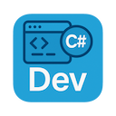

# Dev

[](https://www.nuget.org/packages/HC.Dev/)

A .NET tool designed to simplify common development tasks for .NET projects.

## Installation

You can install the tool globally using the .NET CLI:

```bash
dotnet tool install --global HC.Dev
```

To update to the latest version:

```bash
dotnet tool update --global HC.Dev
```

## Features

### Launch Solution or Project

The default command launches the current solution in your default IDE or project in Visual Studio Code.

```bash
dev
# or
dev launch
```

### Bump Version

Bumps the version of all projects in the current solution or the current project.

```bash
dev bump [major|minor|patch|revision]
```

The bump command supports the following options:
- `major`: Increments the major version (e.g., 1.0.0 → 2.0.0)
- `minor`: Increments the minor version (e.g., 1.0.0 → 1.1.0) - Default
- `patch`: Increments the patch version (e.g., 1.0.0 → 1.0.1)
- `revision`: Increments the revision version (e.g., 1.0.0.0 → 1.0.0.1)

### Bump and Commit Version

Bumps the version of all projects in the current solution or the current project and creates a git commit and tag for the new version.

```bash
dev bump-commit [major|minor|patch|revision]
```

The `bump-commit` command supports the following options:
- `major`: Increments the major version (e.g., 1.0.0 → 2.0.0)
- `minor`: Increments the minor version (e.g., 1.0.0 → 1.1.0) - Default
- `patch`: Increments the patch version (e.g., 1.0.0 → 1.0.1)
- `revision`: Increments the revision version (e.g., 1.0.0.0 → 1.0.0.1)

This command will:
1. Update the version in the `.csproj` or all projects in the `.sln`.
2. Stage the changes using `git add`.
3. Create a commit with the message `build: {version}`.
4. Tag the commit with the new version.

### Build Solution or Project

Builds the current solution or project in Release mode.

```bash
dev build
```

If a `build.cmd` (Windows) or `build.sh` (Linux/macOS) file exists in the same directory, it will be used instead.

### Frontend Building

Runs the Vidyano frontend builder in the current directory using Docker.

```bash
dev frontend
```

This command uses the [`ghcr.io/stevehansen/vidyano-frontend-builder`](https://github.com/stevehansen/vidyano-frontend-builder) Docker image to build your frontend.

### Clean working directory

Removes build output from the current directory.

```bash
dev clean
```

### Help

Displays help information.

```bash
dev help
```

## Command Aliases

The following aliases are available for commonly used commands:

| Alias | Command |
|-|-|
| b | build |
|   | clean |
| h | help |
| f | frontend |
| v | bump |
| vc | bump-commit |

## License

This project is licensed under the MIT License. See the LICENSE file for details.